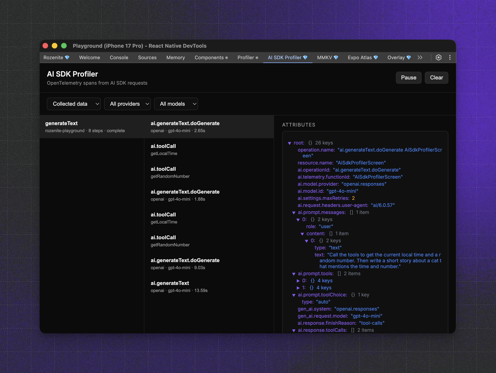

[](https://www.callstack.com/open-source?utm_campaign=generic&utm_source=github&utm_medium=referral&utm_content=react-native-ai)

# React Native AI

A collection of on-device AI primitives for React Native with first-class Vercel AI SDK support. Run AI models directly on users' devices for privacy-preserving, low-latency inference without server costs.

## Features

- 🚀 **Instant AI** - Use built-in system models immediately without downloads
- 🔒 **Privacy-first** - All processing happens on-device, data stays local
- 🎯 **Vercel AI SDK compatible** - Drop-in replacement with familiar APIs
- 🎨 **Complete toolkit** - Text generation, embeddings, transcription, speech synthesis

## AI SDK Compatibility

| React Native AI | AI SDK |
|-----------------|--------|
| 0.11 and below  | v5     |
| 0.12 and above  | v6     |

## DevTools



The AI SDK Profiler plugin captures OpenTelemetry spans from Vercel AI SDK
requests and surfaces them in Rozenite DevTools. DevTools are runtime
agnostic, so they work with on-device and remote runtimes.

```bash
npm install @react-native-ai/dev-tools
```

Rozenite must be installed and enabled in your app. See the
[Rozenite getting started guide](https://www.rozenite.dev/docs/getting-started).

## Available Providers

| Provider | Built-in | Platforms | Runtime | Description |
|----------|----------|-----------|---------|-------------|
| [Apple](#apple) | ✅ Yes | iOS | [Apple](https://developer.apple.com/documentation/FoundationModels) | Apple Foundation Models, embeddings, transcription, speech |
| [Llama](#llama) | ❌ No | iOS, Android | [llama.rn](https://github.com/mybigday/llama.rn) | Run GGUF models via llama.rn |
| [MLC](#mlc) | ❌ No | iOS, Android | [MLC LLM](https://github.com/mlc-ai/mlc-llm) | Run open-source LLMs via MLC runtime |

---

### Apple

Native integration with Apple's on-device AI capabilities. **Built-in** - no model downloads required, uses system models.

- **Text Generation** - Apple Foundation Models for chat and completion
- **Embeddings** - NLContextualEmbedding for 512-dimensional semantic vectors
- **Transcription** - SpeechAnalyzer for fast, accurate speech-to-text
- **Speech Synthesis** - AVSpeechSynthesizer for natural text-to-speech with system voices

#### Installation

```bash
npm install @react-native-ai/apple
```

No additional linking needed, works immediately on iOS devices (autolinked).

#### Usage

```typescript
import { apple } from '@react-native-ai/apple'
import { 
  generateText,
  embed, 
  experimental_transcribe as transcribe, 
  experimental_generateSpeech as speech 
} from 'ai'

// Text generation with Apple Intelligence
const { text } = await generateText({
  model: apple(),
  prompt: 'Explain quantum computing'
})

// Generate embeddings
const { embedding } = await embed({
  model: apple.textEmbeddingModel(),
  value: 'Hello world'
})

// Transcribe audio
const { text } = await transcribe({
  model: apple.transcriptionModel(),
  audio: audioBuffer
})

// Text-to-speech
const { audio } = await speech({
  model: apple.speechModel(),
  text: 'Hello from Apple!'
})
```

#### Availability

| Feature | iOS Version | Additional Requirements |
|---------|-------------|------------------------|
| Text Generation | iOS 26+ | Apple Intelligence device |
| Embeddings | iOS 17+ | - |
| Transcription | iOS 26+ | - |
| Speech Synthesis | iOS 13+ | iOS 17+ for Personal Voice |

See the [Apple documentation](https://react-native-ai.dev/docs/apple/getting-started) for detailed setup and usage guides.

---

### Llama

Run any GGUF model on-device using [llama.rn](https://github.com/mybigday/llama.rn). **Requires download** - models are downloaded from HuggingFace.

#### Supported Features

| Feature | Method | Description |
|---------|--------|-------------|
| Text Generation | `llama.languageModel()` | Chat, completion, streaming, reasoning models |
| Embeddings | `llama.textEmbeddingModel()` | Text embeddings for RAG and similarity search |
| Speech | `llama.speechModel()` | Text-to-speech with vocoder models |

#### Installation

```bash
npm install @react-native-ai/llama llama.rn react-native-blob-util
```

#### Usage

```typescript
import { llama } from '@react-native-ai/llama'
import { generateText, streamText } from 'ai'

// Create model instance (Model ID format: "owner/repo/filename.gguf")
const model = llama.languageModel('ggml-org/SmolLM3-3B-GGUF/SmolLM3-Q4_K_M.gguf')

// Download from HuggingFace (with progress)
await model.download((progress) => {
  console.log(`Downloading: ${progress.percentage}%`)
})

// Initialize model (loads into memory)
await model.prepare()

// Generate text
const { text } = await generateText({
  model,
  messages: [
    { role: 'system', content: 'You are a helpful assistant.' },
    { role: 'user', content: 'Write a haiku about coding.' },
  ],
})

// Cleanup when done
await model.unload()
```

#### Model Compatibility

Any GGUF model from HuggingFace can be used. Use the format `owner/repo/filename.gguf` as the model ID. Popular choices include:

- `ggml-org/SmolLM3-3B-GGUF/SmolLM3-Q4_K_M.gguf`
- `bartowski/Llama-3.2-3B-Instruct-GGUF/Llama-3.2-3B-Instruct-Q4_K_M.gguf`
- `Qwen/Qwen2.5-1.5B-Instruct-GGUF/qwen2.5-1.5b-instruct-q4_k_m.gguf`

📚 **[View full Llama documentation →](https://react-native-ai.dev/docs/llama/getting-started)**

---

### MLC

Run popular open-source LLMs directly on-device using [MLC LLM](https://github.com/mlc-ai/mlc-llm)'s optimized runtime. **Requires download** - models must be downloaded before use.

#### Installation

```bash
npm install @react-native-ai/mlc
```

Requires the "Increased Memory Limit" capability in Xcode. See the [getting started guide](https://react-native-ai.dev/docs/mlc/getting-started) for setup instructions.

#### Usage

```typescript
import { mlc } from '@react-native-ai/mlc'
import { generateText } from 'ai'

// Create model instance
const model = mlc.languageModel('Llama-3.2-3B-Instruct')

// Download and prepare model (one-time setup)
await model.download()
await model.prepare()

// Generate response with Llama via MLC engine
const { text } = await generateText({
  model,
  prompt: 'Explain quantum computing'
})
```

#### Available Models

| Model ID | Size |
|----------|------|
| `Llama-3.2-3B-Instruct` | ~2GB |
| `Phi-3-mini-4k-instruct` | ~2.5GB |
| `Mistral-7B-Instruct` | ~4.5GB |
| `Qwen2.5-1.5B-Instruct` | ~1GB |

> [!NOTE]
> MLC requires iOS devices with sufficient memory (1-8GB depending on model). The prebuilt runtime supports the models listed above. For other models or custom configurations, you'll need to recompile the MLC runtime from source.

## Documentation

Comprehensive guides and API references are available at [react-native-ai.dev](https://react-native-ai.dev).

## Contributing

Read the [contribution guidelines](/CONTRIBUTING.md) before contributing.

## Made with ❤️ at Callstack

**react-native-ai** is an open source project and will always remain free to use. If you think it's cool, please star it 🌟. 

[Callstack][callstack-readme-with-love] is a group of React and React Native geeks, contact us at [hello@callstack.com](mailto:hello@callstack.com) if you need any help with these or just want to say hi!

---

Made with [create-react-native-library](https://github.com/callstack/react-native-builder-bob)

[callstack-readme-with-love]: https://callstack.com/?utm_source=github.com&utm_medium=referral&utm_campaign=react-native-ai&utm_term=readme-with-love
